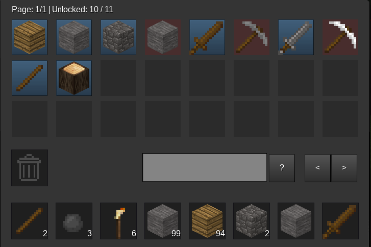

# crafting

Adds semi-realistic crafting with unlockable recipes to Minetest, and removes
the craft grid.

By rubenwardy  
License: LGPLv2.1+



## Image Licenses

rubenwardy (CC BY-SA 3.0):
  crafting_slot_*.png

Neuromancer (CC BY-SA 3.0):
  crafting_furnace_*.png

BlockMen (CC BY-SA 3.0):
  gui_*.png

paramat (CC BY-SA 3.0)
  creative_trash_icon.png  (derived from a texture by kilbith, same license)

## Limitations

Any recipes must be designed such that any particular item can only be used
as one of the ingredients.

For example, you can't have the following recipe as `default:wood` could
be used twice: `default:wood, group:wood`.

## API

* crafting.register_type(name)
	* Register a type `type` used when searching for recipes

* crafting.register_recipe(def)
	* Returns id.
	* `def` a table with the following fields:
		* `type`   - one of the registered types.
		* `output` - the result of the craft, eg: `default:stone 3`.
		* `items`  - A list of ingredients, eg: `{"stone", "wood 3"}`.
		* `level`  - level of station required.
		* `always_known` - If true, this recipe will never need to be unlocked.

* crafting.get_recipe(id)
	* Get recipe by ID

* crafting.get_unlocked(name)
	* `name` is the player's name
	* Returns a dictionary of recipe output to boolean.

* crafting.unlock(name, v)
	* `name` is the player's name
	* `v` is a single output or list of outputs

* crafting.get_all_for_player(player, type, level)
	* Returns a list of results, each a table
		* `items` - a key-value table, key being item name and value being a table:
			* `have` - how many the player has
			* `need` - how many of this item needed
		* `recipe` - the recipe
		* `craftable` - is craftable?		
	* `craftable` is a table of the items the player can craft with the items they have.
	* `uncraftable` is a table of items the player knows about, but is missing items for.

* crafting.get_all(type, level, item_hash, unlocked)
	* Returns same as above.
	* `item_hash` - a table with keys being item names or group names (eg: `group:wood`)
	                and the value being the number required.
	* `unlocked`  - a list of outputs the player has unlocked.

* crafting.set_item_hashes_from_list(inv, listname, item_hash)
	* Iterates through the list and adds or updates entries in item_hash
	  representing the number of items for each names and group.

* crafting.find_required_items(inv, listname, recipe)
	* Returns a list of stacks to take, or nil if the required items could not
	  be found.

* crafting.has_required_items(inv, listname, recipe)
	* Returns true if the `"main"` list in `inv` contains the required items.

* crafting.perform_craft(name, inv, listname, outlistname, recipe)
	* Will try to take itemsfrom `listname` and put output in the `outlistname` list in `inv`.
	* Returns true on success.

* crafting.make_result_selector(player, type, level, size, context)
	* Generates a paginated form which a search box.
	* `type`    - craft type.
	* `size`    - how many slots to show on a page.
	* `context` - server-side storage between show and submit, can be `{}`.
		* `crafting_page` - page to show

* crafting.result_select_on_receive_results(player, type, level, context, fields)
	* Handles form submissions for the result selector.
	* Returns true if the formspec should be shown again.

* crafting.make_on_rightclick(type, level, inv_size)
	* Returns a function to be used as on_rightclick for node work stations.

* crafting.create_async_station(name, type, level, def_inactive, def_active)
	* Makes a station which players put items into and then leave to craft.
	* Registers two nodes - inactive and active versions of the station.

## Development


**Installation:**

```sh
# Dependencies for linter and test framework
sudo apt install luarocks
sudo luarocks install luacheck
sudo luarocks install busted

# Set up git hook to disallow commiting when linter or tests fail
./utils/setup.sh
```
